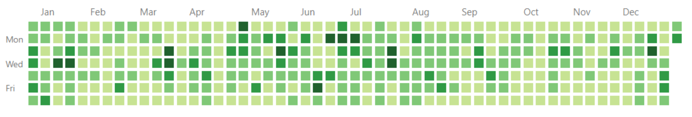
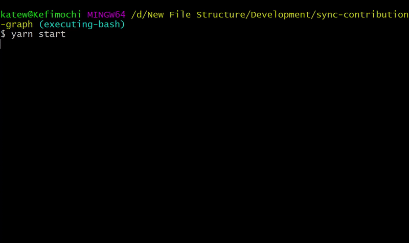

<h1 align="center">
  Sync Contribution Graph
</h1>

## How to Use 🚀

1. [Use this repo as a template](https://github.com/kefimochi/sync-contribution-graph/generate) to create a new repo, and provide a name.
2. Clone your new repo locally.  `cd` into the newly created directory.
3. It requires NodeJS and `npm` (or `yarn`) to be installed on your machine. Run `npm i` or `yarn install` in your terminal.
4. Use `npm start` or `yarn start` in order to trigger a series of terminal prompts that will help with configuration.
   > On Windows, please run it from Git Bash.

If you change your mind about these commits later, you can delete the repository and they'll disappear from your contribution graph. In my case, I used this to sync comits 2021-2022 from my Eventbrite account [here](https://github.com/kateefimova-eb?tab=overview&from=2022-12-01&to=2022-12-31). 

## Requested Information 🌳

| Key        | Description                                                                                                                                                 | Default value                                        |
| ---------- | ----------------------------------------------------------------------------------------------------------------------------------------------------------- | ---------------------------------------------------- |
| `username` | The username whose graph contributions you'd like to copy.                                                                                                  |                                                      |
| `year`     | Year that you would like to sync with provided `username`. Currently doesn't support multiple years.                                                        | Current year                                         |
| `execute`  | Let's the code know whether to simply generate `script.sh` that, when executed, will force push commits to `main`. Or to both generate and execute at once. | `false`, in other words generate _without_ execution |
| `confirm`  | A quick double check that you're ready to proceed.                                                                                                          |

## How do I know this is secure? 🔒

Explore the [code](src/index.js)! It's tiny and there aren't many dependencies.

It only scrapes publicly available data from existing GitHub contribution graphs. It does not have access to private commits or issues created. So I can promise that you will not get in trouble for syncing your personal and work GitHub graphs considering there isn't any private company code being exposed!

## On Project's Future ✨

There's a lot of potential features and automations that could be added! Something as basic as accepting multiple years to pull at once, or more complicated like having a GitHub Action that once per month/year/time period creates a PR with newer commits, making it effortless to keep them synced.

## Contribute 👪

PRs are welcome! One day I'll probably write a Contributing guide. This project is [MIT](LICENSE) licensed.
